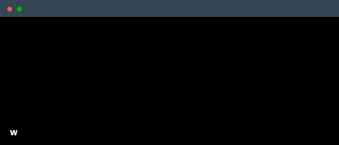

<!--  
 Credit to: @daria-stanilevici
 Your own Terminal GIF can be created here: 
        https://www.terminalgif.com
-->

 

    

### About Me
I’m passionate about solving problems! With a strong technical foundation, I excel at connecting people and working closely with businesses. My mission is to create meaningful connections, drive collaboration, and take on challenges that make a real difference.

<!--  -->

### Main skills

  

  

<!--  -->

### Studying

  

### Connect with me!

    

<!-- ### Employer?
> [!IMPORTANT]  
> <a href="https://drive.google.com/drive/folders/1hJGhQTtzDUzMqRtoIQUx7QTLtCN726ZK?usp=sharing" download>Download my resume</a> -->

